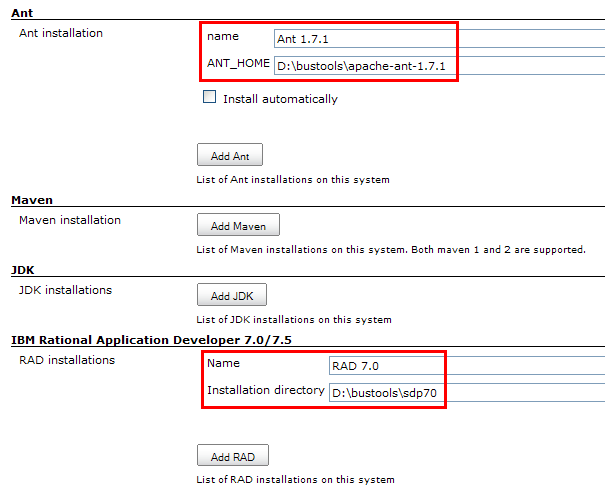
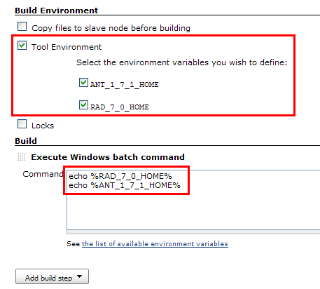
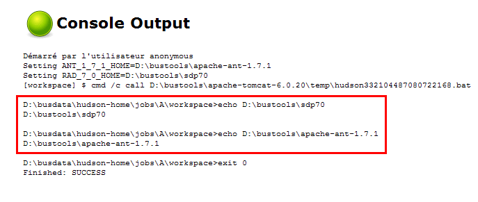

[[git-plugin]]
= Tool Environment Plugin
:toc: macro
:toc-title:

link:https://ci.jenkins.io/job/Plugins/job/toolenv-plugin/job/master/[image:https://ci.jenkins.io/job/Plugins/job/toolenv-plugin/job/master/badge/icon[Build Status]]
link:https://github.com/jenkinsci/toolenv-plugin/graphs/contributors[image:https://img.shields.io/github/contributors/jenkinsci/toolenv-plugin.svg?color=blue[Contributors]]
link:https://github.com/jenkinsci/toolenv-plugin/releases/latest[image:https://img.shields.io/github/release/jenkinsci/toolenv-plugin.svg?label=changelog[GitHub release]]
link:https://plugins.jenkins.io/toolenv[image:https://img.shields.io/jenkins/plugin/i/toolenv.svg?color=blue&label=installations[Jenkins Plugin Installs]]

== Introduction

Tool environment plugin lets you use "tools" in unusual ways, such as from shell scripts.

See http://issues.jenkins-ci.org/browse/JENKINS-4532[JENKINS-4532] for motivation.

Some screenshots are better than a long discussion:

. This is what you define in the Jenkins configuration screen: +

. This is how you use the plugin in a job: +

. This is what you get: +

Compared to
https://plugins.jenkins.io/custom-tools-plugin/[Custom Tools
Plugin] the advantage is that you can use the tool in arbitrary ways,
not just running an executable from it.

== Release notes

See https://github.com/jenkinsci/toolenv-plugin/releases[GitHub Release] for more recent versions.

1.1 released Mar 27 2013

1.0 released Feb 15 2010
